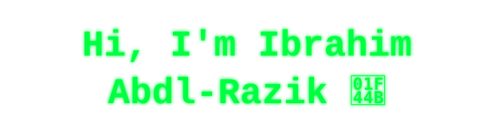

<div align="center">




[](https://dashtx707.github.io/Portofolio/)

[](https://www.linkedin.com/in/irazik)
[](https://x.com/DasHTX0)
[](mailto:ibrahimabdlrazik@gmail.com)
[](https://tryhackme.com/p/DashTX)
[](https://cyberdefenders.org/p/DashTX)

</div>

```bash
ibrahim@soc:~$ whoami
Cyber Threat Detection & Threat Intelligence Specialist
Senior SOC Consultant — 5+ years in cybersecurity

ibrahim@soc:~$ cat background.txt
B.Sc. Computer Science, Mansoura University (2017)
Military Signals Intelligence background
Training: SANS FOR508/608, SpecterOps Tradecraft Analysis, Applied Network Defense, TCM Security
MITRE ATT&CK Defender™ certified — CTI, SOC Assessments & Threat Hunting

ibrahim@soc:~$ history | grep -A3 employer
[current]  SIDF (Saudi Industrial Development Fund) — Riyadh, KSA
[prev]     BDC (Banque Du Caire)
[prev]     COR (Coordinates Middle East by GBM)
[prev]     Securenass

ibrahim@soc:~$ cat links.txt
tryhackme.com/p/DashTX | cyberdefenders.org/p/DashTX | dashtx707.github.io/Portofolio
```

## 🧰 `tools --list`


## 🎯 `ls -la projects/`
- **[+] MENA Threat Actor Tracker** — 29 APT + 25 ransomware groups tracked with cited sourcing, country-specific KSA/Egypt TTP breakdowns mapped to MITRE ATT&CK, Sigma detection-coverage auditing against a 3,700+ rule corpus, and monthly scheduled-routine automation.
- **[+] Automated Weekly Threat Intelligence Pipeline** — scheduled OSINT-to-Sigma pipeline with a human-review gate before anything reaches `main`.
- **[+] External Threat Profile Orchestration** — Mandiant-structured external threat profiling for any named org using public data only.
- **[+] Hunt-to-Detection Closure Loop** — routes confirmed hunt findings into detection engineering, then validates with purple-team simulation.
- **[+] Threat Hunting Queries & MITRE ATT&CK Detection Library** — baselined hunt queries and Sigma rules mapped to ATT&CK tactics/techniques.
- **[+] SOC Automation & Incident Response Playbooks** — NIST SP 800-61 / SANS PICERL aligned IR chain with mandatory post-incident detection validation.
- **[+] Comprehensive Vulnerability Assessment** — Shodan/Nmap/Dirsearch/Xray/Metasploit-driven assessment uncovering 8 critical findings.

`>` Full write-ups: [Portfolio site](https://dashtx707.github.io/Portofolio/) · [Portofolio repo](https://github.com/DashTX707/Portofolio)

## 📜 `cat certifications.log`
| Certification | Issuer | Year |
|---|---|---|
| GIAC Foundational Cybersecurity Technologies (GFACT) | GIAC | 2023 |
| MITRE ATT&CK Defender™ (MAD) — ATT&CK Fundamentals | MITRE | — |
| MITRE ATT&CK Defender™ (MAD) — SOC Assessments | MITRE | — |
| MITRE ATT&CK Defender™ (MAD) — Cyber Threat Intelligence | MITRE | — |
| MITRE ATT&CK Defender™ — Threat Hunting | MITRE | — |
| Certified Ethical Hacker (CEH) | EC-Council | 2020 |
| EC-Council Certified Incident Handler (ECIH) | EC-Council | 2020 |
| Computer Hacking Forensic Investigator (CHFI) | EC-Council | 2020 |
| AWS Certified Cloud Practitioner Essentials | AWS | — |
| IBM Resilient SOAR Foundations | IBM | — |

## 🎙 `tail -f talks.log`
**Conference Workshops** — _coming soon_
**Podcasts** — _coming soon_

## 📡 `tail -f /var/log/activity.log`
<!--START_SECTION:activity-->
1. 🎉 Merged PR [#14](https://github.com/DashTX707/DashTX707/pull/14) in [DashTX707/DashTX707](https://github.com/DashTX707/DashTX707)
2. 💪 Opened PR [#14](https://github.com/DashTX707/DashTX707/pull/14) in [DashTX707/DashTX707](https://github.com/DashTX707/DashTX707)
3. 🎉 Merged PR [#13](https://github.com/DashTX707/DashTX707/pull/13) in [DashTX707/DashTX707](https://github.com/DashTX707/DashTX707)
4. 💪 Opened PR [#13](https://github.com/DashTX707/DashTX707/pull/13) in [DashTX707/DashTX707](https://github.com/DashTX707/DashTX707)
5. 🎉 Merged PR [#12](https://github.com/DashTX707/DashTX707/pull/12) in [DashTX707/DashTX707](https://github.com/DashTX707/DashTX707)
<!--END_SECTION:activity-->

## 📊 `uptime --stats`

<div align="center">


</div>

## ⚡ `fortune`
Started my career in Military Signals Intelligence before pivoting into SOC operations and threat intelligence.

## 📝 `tail blog.md`
Coming soon — follow me on [LinkedIn](https://www.linkedin.com/in/irazik) for security insights and write-ups.

<div align="center">


</div>
